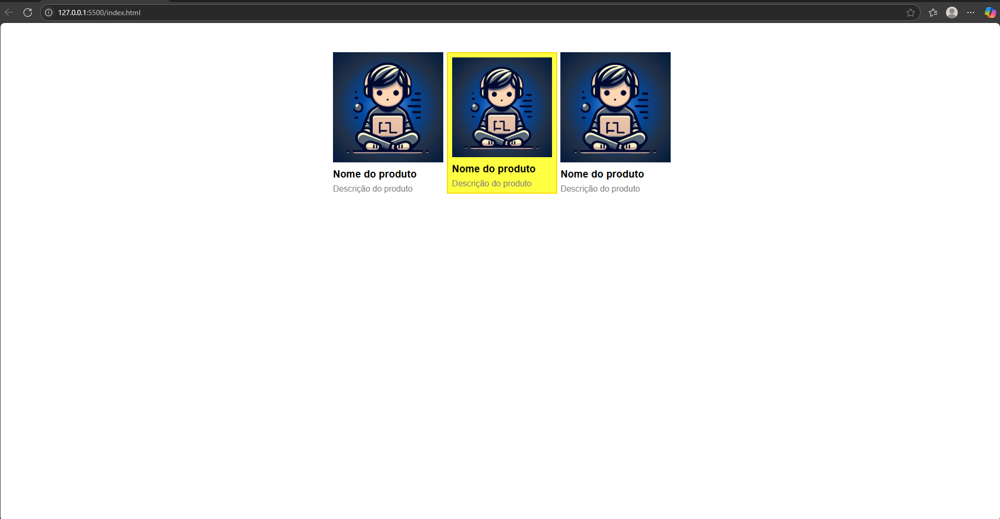

<h1 align="center">Tarefa Módulo 19 </h1>

<p align="center">
  <a href="#-tecnologias">Tecnologias</a>&nbsp;&nbsp;&nbsp;|&nbsp;&nbsp;&nbsp;
  <a href="#-projeto">Projeto</a>&nbsp;&nbsp;&nbsp;

<br>

<p align="center">
  
</p>

## 🚀 Tecnologias

Esse projeto foi desenvolvido com as seguintes tecnologias:

- HTML, CSS & SCSS/SASS
- Git e Github
- Node para instalação de SASS
- Usado arquitetura de CSS, BEM

## 💻 Projeto

Este é o meu mais recente trabalho.
PROJETO CONSTRUIDO PARA O CURSO DE DESENVOLVEDOR FULL STACK PYTHON DA EBAC.

- [Acesse o projeto finalizado, online](https://ebac-mod-19-task.vercel.app/)

## Desafio proposto

1. Os arquivos estão disponibilizados abaixo, no material de apoio. O HTML fornecido já possui classes; atualize essas classes de acordo com a Metodologia BEM. Ou seja, faça a separação em blocos, elementos e/ou modificadores.

2. Após a conclusão da marcação HTML, prossiga para a transcrição do CSS, utilizando o sistema de blocos, elementos e/ou modificadores.

3. A escolha da abordagem para a transcrição dos estilos é livre: você pode optar por utilizar SASS, LESS ou até mesmo redigir as atualizações diretamente no CSS puro.

4. O exercício deve ser entregue por meio do GitHub e armazenado na branch "boas_praticas_css" do seu repositório. Caso tenha utilizado algum pré-processador (SASS ou Less), certifique-se de incluir os arquivos correspondentes no repositório.

Dica: realize testes após cada alteração efetuada. A entrega do exercício deve garantir que o projeto funcione da mesma forma que o projeto original.

## Baixei arquivos disponibilizados

Após isso fui organizar as pastas para inicio da tarefa, criei a pasta BEM, dentro dela o arquivo main.scss,

## inicializei `npm init`

## após isso baixei o sass `npm install --save-dev sass `

## Configurando o package.json

```
 "scripts": {
    "sass": "sass",
    "test": "echo \"Error: no test specified\" && exit 1"
  },
```

## Compilando o SASS
```
 npm run sass .\bem\main.scss .\bem\main.css
 ```